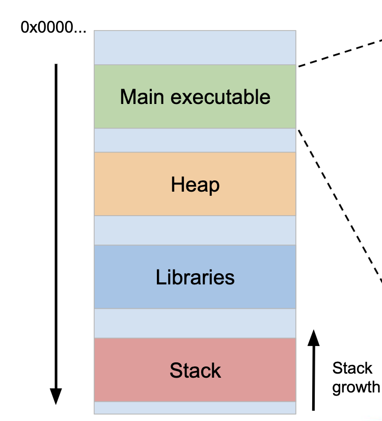
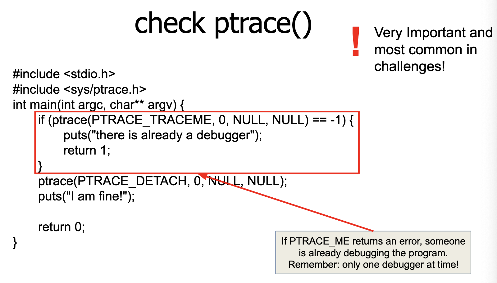
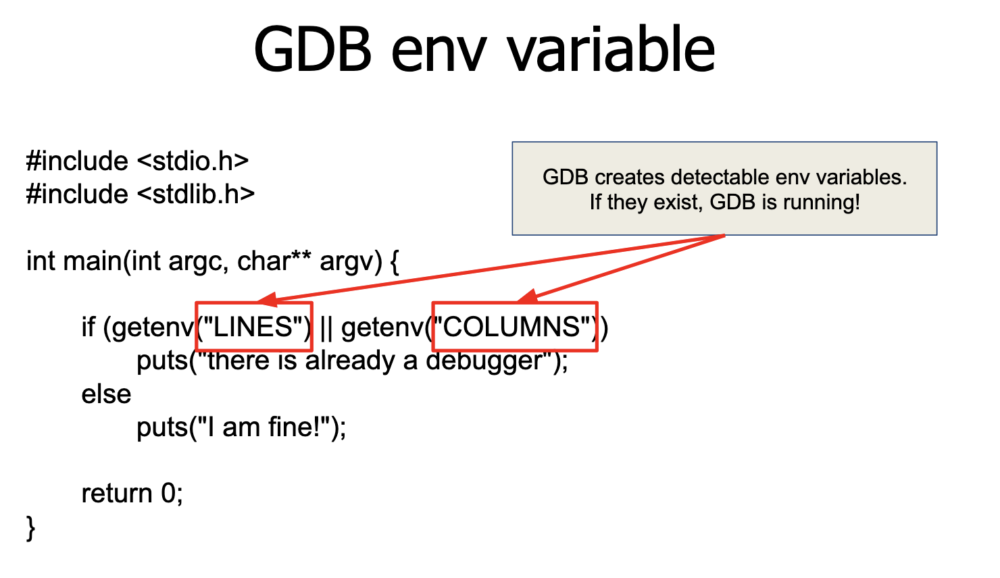
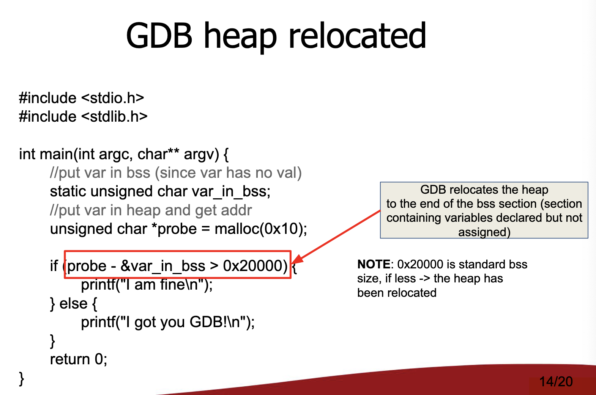
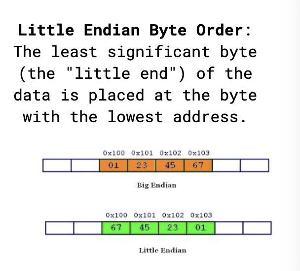
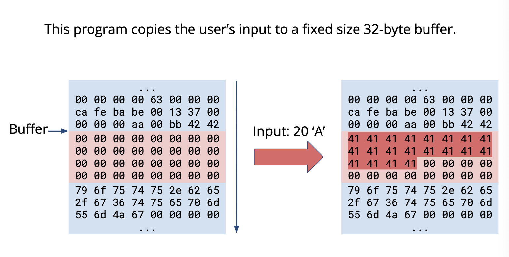
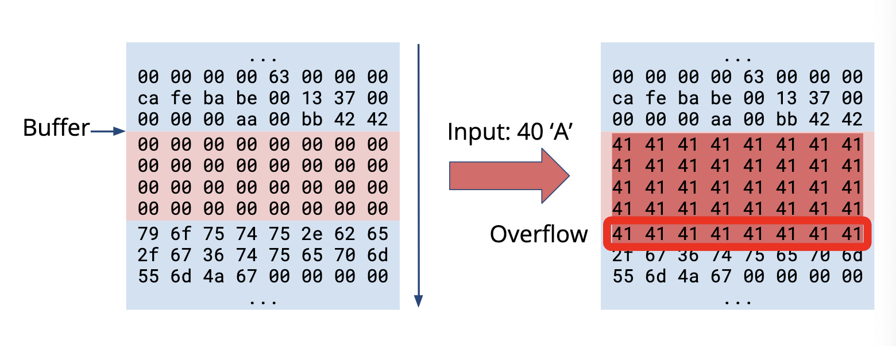
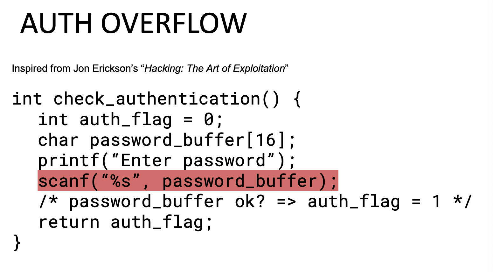
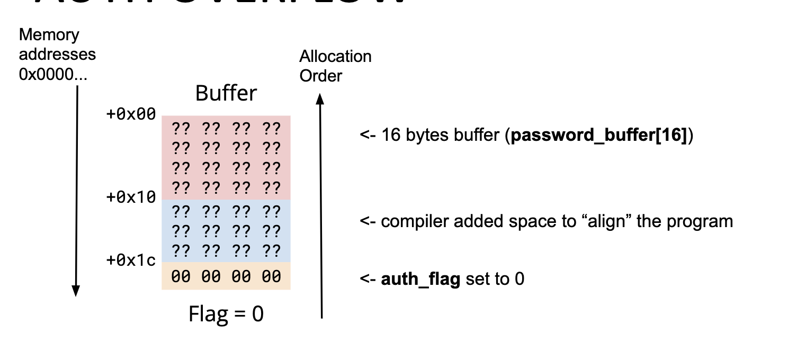

# Introduzione a Reverse
Due tipologie di analisi di un binario:
- Analisi statica (e.g. decompilazione)
- Analisi dinamica (e.g. debugging)

## Hex Editor
Viene utilizzato per patchare programmi, analizzare i formati dei file e cambiarne il contenuto.

## Stack
Lo stack cresce contro corrente rispetto alla memoria.
Quando creo variabili locali, esse vengono messe secondo l'ordine dello stack in memoria: quindi l'ultima dichiarata è in cima allo stack, vale a dire avere un posizionamento in memoria più basso rispetto alle altre variabili del frame (ecco perché vi è il problema del buffer overflow: la scrittura segue la memoria).
<b>ATTENZIONE</b>: le struct sono create in maniera differente: vengono visti come variabili uniche e le variabili interne seguono l'ordine di memoria.

 

## Istruzioni ASM
- `MOV <dst>, <src>`: copia `src` in `dst` (e.g. `MOV EAX, EBX` è come scrivere `EAX=EBX`)
- `LEA <dst>,<src>`: carica l'indirizzo effettivo di `src` in `dst`. Viene usato per accedere a elementi di buffer/array e per eseguire semplici operazioni matematiche (e.g. `LEA ECX, [EAX+3]` è come scrivere `ECX=EAX+3`)
- `PUSH <src>`: decrementa `RSP` (cioè aumenta lo stack) e inserisce `<src>` nello stack.
- `POP <dst>`: incrementa `RSP` e tira via il valore in cima allo stack
- `ADD <dst>, <src>`: `<dst>+=<src>`
- `SUB <dst>, <src>`: `<dst>-=<src>`
- `CMP <dst>, <src>`: fa il compare tra `<dst>` e `<src>` mediante una SUB (di cui butta via il risultato)
- `JMP <dst>`: fa un JUMP a una determinata istruzione presente in indirizzo `<dst>`. Viene anche chiamato salto incondizionato
- `Jxx <dst>`: parliamo di salti condizionati. Vengono usati per gestire il flusso del programma (IF)
    - `JZ`: Jump If Zero
    - `JNZ`: Jump If NOT Zero
    - e molti altri
- `XOR <dst>,<src>`: fa il BITWISE XOR tra `<dst>` ed `<src>`
- `CALL <dst>`: chiama una subroutine ad indirizzo `<dst>`
- `RET`: fa il ritorno da una subroutine (fa il pop dell'indirizzo di ritorno dallo stack e jumpa ad esso)

# Patching
Cose che possiamo fare per patchare un binario
- Riempire con `NOP` 
- Invertire le branches (`JE <-> JNE`)
- Rimuovere le branches (`NOP/JMP`)
- Cambiare qualche costante/valore (e.g. stringhe e numeri, per esempio quando si effettua il ritorno)
- Incollare nuove funzioni (non è comune, ma può succedere)

# Debugging
Partiamo dalle basi: il <b>kernel</b>.
Il kernel gestisce le interazioni tra il debugger e il debugee (in questo caso un ELF).
Fornisce strumenti per fare debug: <b`ptrace()`></b>.

`ptrace()` è una chiamata di sistema linux che consente a un processo (debugger) ad ispezionare e controllare un altro processo (debugee).
Vi possono essere delle tecniche di <b>ANTI-DEBUGGING</b>.

## Come bypassare un antidebugging?
Step principali:
1. Visionare per la presenza di implementazioni di tecniche di antidebug (riportate qua sopra). Controllare anche non main thread:
    - .init e .fini possono contenere implementazioni di tecniche di antidebug
2. Patchare l'implementazione

# PWN
Quello che facciamo noi di PWN è l'exploitare la <b>memory corruption</b>.
Che cos'è: è la modifica della memoria di un processo in un modo non inteso dal programmatore.
Se controlliamo la memoria, controlliamo il processo.

- Buffer overflows: ovvero dati scritti in buffer corrompono i dati adiacenti al buffer stesso
- Out of bound accesses: eccedere il bound dell'array per accedere ad aree di memorie non assegnate all'array
- Format string: ovvero inviare dati che sono valutati come comandi per l'applicazione
- Dangling pointers
- Type confusion
... e molti altri

## Memory corruption attacks
Due sottoclassi
- Non-Control-Data Attacks manipolano lo stato e i dati del programma
- Contro-Flow Attacks controllano il flusso di esecuzione

La memoria è una sequenza di byte. Punto. Ogni byte è identificato da indirizzo.
Tramite protezioni di memoria, le aree di memoria possono essere marcate leggibili, scrivibili ed eseguibili.
I tipi non esistono in memoria (e.g., gli interi sono little-endian in x86 [anche i puntatori])

Alcuni linguaggi non controllano i bound degli array (tipo C/C++).

 

